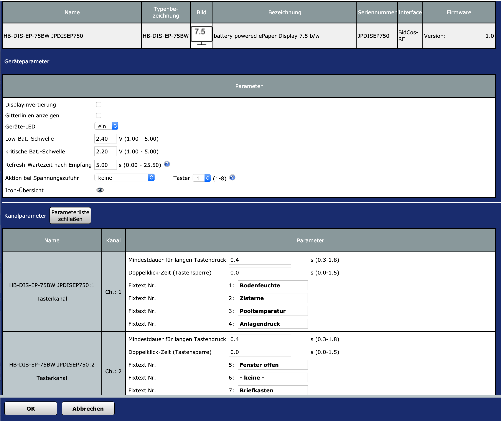

# HB-Dis-EP-75BW

</img><br/>
_Erster Prototyp: Rahmen nur fix als Hilfe gedruckt, um das Display vor versehentlichen Beschädigungen zu schützen._<br/><br/>
</img><br/>
_Aufbau in 3 Spalten á 6 Zeilen. Gitternetz lässt sich optional einblenden.<br/>_
_Die Flecken auf dem Display sind Luftblasen unter der noch vorhandenen Schutzfolie_<br/>

## Infos
Thread im Homematic-Forum: https://homematic-forum.de/forum/viewtopic.php?f=76&t=51985&p=521315

## Parts
- siehe [4.2" ePaper Projekt](https://github.com/jp112sdl/HB-Dis-EP-42BW#parts)
- 7.5" ePaper Display
  - [mit SPI Controller](https://www.exp-tech.de/displays/e-paper-e-ink/8884/waveshare-7.5-e-ink-display-hat-for-raspberry-pi-640x384?c=1424) 
  - [ohne SPI Controller](https://www.exp-tech.de/displays/e-paper-e-ink/8697/640x384-7.5inch-e-ink-raw-display?c=1424) _(falls man noch einen rumzuliegen hat ^^)_

Beispielskript, mit dem der abgebildete Inhalt erzeugt wurde:<br>
```
!0x02 = Nachrichten-Anfang
var cmd = "0x02,";

!links

!0x18 = Icon
!0x80 = Position 0x80 (Zeile 1, Spalte 1)
!0x9b = Icon-Index
cmd = cmd # "0x18,0x80,0x9b,";

!0x11 = Text normal, 
!0xc0 = Position 0x80 + zentriert 0x40,
!Text: 0x80 = Fixtext Nr. 1 (Bodenfeuchte)
cmd = cmd # "0x11,0xc0,0x80,";
!0x12 = Text fett
!0xc1 = Position 0x81 + zentriert 0x40
!Text: "84%"
cmd = cmd # "0x12,0xc1,0x38,0x34,0x25,";

cmd = cmd # "0x18,0x81,0x83,";
cmd = cmd # "0x11,0xc2,0x81,";
cmd = cmd # "0x12,0xc3,0x39,0x31,0x25,";

cmd = cmd # "0x18,0x82,0x9d,";
cmd = cmd # "0x11,0xc4,0x82,";
cmd = cmd # "0x12,0xc5,0x32,0x31,0x2C,0x37,0x92,";

cmd = cmd # "0x18,0x83,0x88,";
cmd = cmd # "0x11,0xc6,0x8e,";
cmd = cmd # "0x12,0xc7,0x90,";


!cmd = cmd # "0x18,0x84,0xfe,";
!cmd = cmd # "0x11,0x88,0xfe,";
!cmd = cmd # "0x12,0x89,0xfe,";

cmd = cmd # "0x18,0x85,0x89,";
cmd = cmd # "0x11,0xca,0x8d,";
cmd = cmd # "0x12,0xcb,0x90,";

!mitte
cmd = cmd # "0x18,0x87,0x91,";
cmd = cmd # "0x11,0xce,0x86,";
cmd = cmd # "0x12,0xcf,0x88,";

cmd = cmd # "0x18,0x88,0x98,";
cmd = cmd # "0x11,0xd0,0x89,";
cmd = cmd # "0x12,0xd1,0x8a,";

cmd = cmd # "0x18,0x89,0x85,";
cmd = cmd # "0x11,0xd2,0x8c,";
!0x12 = Text fett
!0xd3 = Position 0x93 + zentriert 0x40
!Text: 06.08. + Fixtext Nr. 22 (Papier)
cmd = cmd # "0x12,0xd3,0x30,0x36,0x2e,0x30,0x38,0x2E,0x20,0x95,";

!rechts

cmd = cmd # "0x18,0x8c,0x99,";
cmd = cmd # "0x11,0x98,0x83,";
cmd = cmd # "0x12,0x99,0x32,0x2e,0x31,0x34,0x94,";

!0x18 = Icon
!0xd1 = Position 0x91 + rechtsbuendig 0x40
!0x96 = Icon-Index
cmd = cmd # "0x18,0xd1,0x96,";
!0x11 = Text normal
!0xa2 = Position 0xa2
!0x99 = Fixtext Nr. 26
cmd = cmd # "0x11,0xa2,0x99,";
cmd = cmd # "0x12,0xa3,0x9b,";

!0x03 = Nachrichten-Ende
cmd = cmd # "0x03";

WriteLine(cmd);
dom.GetObject("BidCos-RF.JPDISEP750:9.SUBMIT").State(cmd);
```

</img><br/>
_Schematische Aufteilung des Displays_<br/>

</img><br/>
_Einstellmöglichkeiten_<br/>

</img><br/>
_Übersicht der verfügbaren Icons_<br/>

## Frequenztest

Damit man auf dem ATmega1284 den [Frequenztest](https://asksinpp.de/Grundlagen/FAQ/Fehlerhafte_CC1101.html#ermittlung-der-cc1101-frequenz) laufen lassen kann sind folgende Änderungen am FreqTest-Sketch notwendig:
- Pinout von "Standard pinout" auf "Bobuino pinout" umstellen
- das #define CC1101_GDO0_PIN von 2 auf 6 ändern
- das #define LED_PIN von 1 auf 5 ändern
